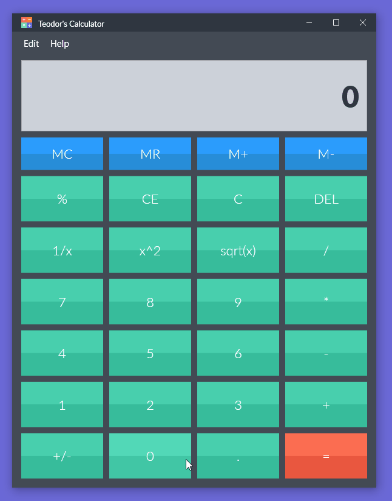
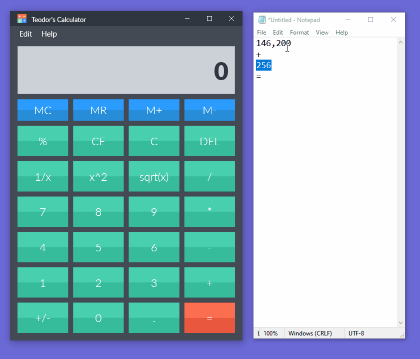
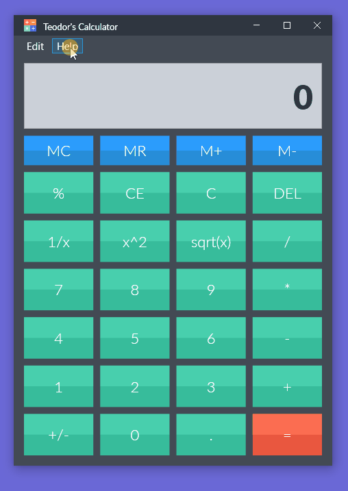

#  WPF Calculator

 

# General Presentation
This repository represents the work I've done for one of the 3 assessments at Visual Programming Environments, in 2019, at Transylvania University of Brașov, Romania.

## Purpose
The purpose of this assessment was to implement a calculator windows application, using WPF and C#. The calculator needed to have most of window's default calculator functionalities, like: basic & complex operators, digit grouping, memory management, clipboard awareness

## Technologies and dependencies
For the implementation of this project I've used the following technologies and dependencies:
- **Visual Studio**: IDE
- **C#**: Programming language
- **[.NET Framework WPF](https://docs.microsoft.com/en-us/dotnet/desktop/wpf/?view=netframeworkdesktop-4.8)**: A free and open-source graphical subsystem originally developed by Microsoft for rendering user interfaces in Windows-based applications

 

# Project Presentation

### Functionalities:
#### 1. Basic calculus with memory management and additional complex operations, like: 1/x, x^2, sqrt(x)
 
#### 2. Fully responsive UI
 
#### 3. Clipboard awareness (copy, paste & cut functionalities)
 
#### 4. Help Section with information about user's processor and operating system
 
